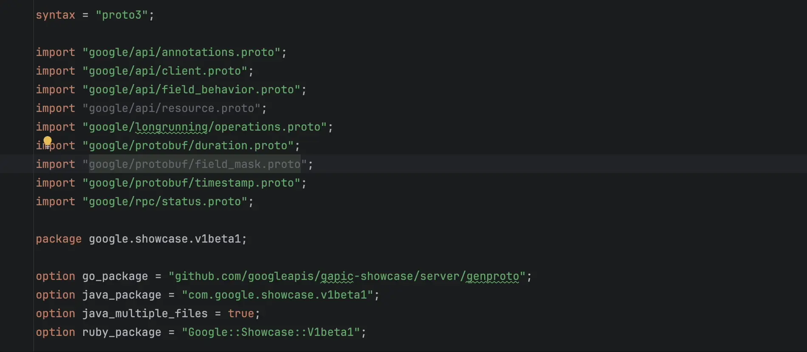
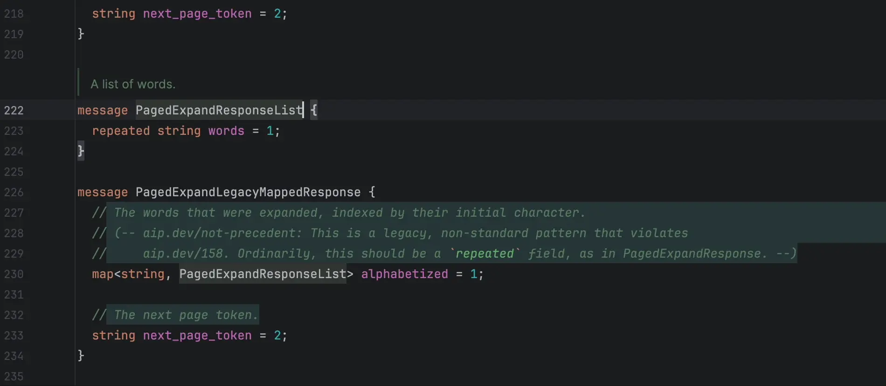
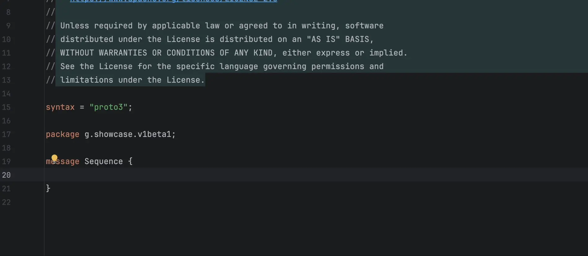
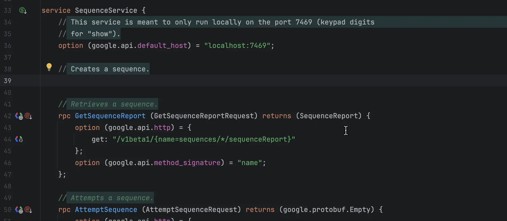

# IntelliJ Protobuf Language Plugin

## Reference

Inspired by [protobuf-jetbrains-plugin](https://github.com/ksprojects/protobuf-jetbrains-plugin)
and [intellij-protobuf-editor](https://github.com/jvolkman/intellij-protobuf-editor).

## Descriptor

<!-- Plugin description -->
IntelliJ-based IDEs Protobuf Language Plugin that provides Protobuf language support.

> [!WARNING]
> This plugin is not compatible
> with [Jetbrains Official Protobuf Plugin](https://plugins.jetbrains.com/plugin/14004-protocol-buffers) bundled in
> 2021.2 and later.  
> You should disable **Protocol Buffer** and **gRPC** to use this plugin.

Analyzing features:

✅ Syntax highlighting  
✅ Symbol and References  
✅ Import file from library and SDK  
✅ Navigation  
✅ Find Usage  
✅ Code folding  
✅ Semantic analysis  
✅ Struct Viewer  
✅ Quick documentation  
✅ PSI stub  
✅ Java/Kotlin support  
✅ [Sisyphus](https://github.com/ButterCam/sisyphus) framework integration  
✅ Decompile from proto descriptor for golang  
✅ Send gRPC native/transcoding requests via [Http Client](https://plugins.jetbrains.com/plugin/13121-http-client)  
✅ Explore gRPC APIs via [Endpoints](https://plugins.jetbrains.com/plugin/16890-endpoints)  
✅ [Buf](https://buf.build/) support
via [Buf for Protocol Buffers](https://plugins.jetbrains.com/plugin/19147-buf-for-protocol-buffers)  
✅ [Protobuf Editions](https://protobuf.dev/editions/overview/) support  
✅ [Protobuf Text Format](https://protobuf.dev/reference/protobuf/textformat-spec/) support

Editor features:

✅ Auto Completion  
✅ Code format  
✅ Import optimizing  
✅ [AIP](https://google.aip.dev/) spec support  
✅ Auto import  
✅ Import quick fix  
✅ Edit protobuf line comments as markdown

<!-- Plugin description end -->

## Screenshots

### Highlight Features

1. Import optimizer  
   

2. Reference  
   

3. In-place rename  
   

4. Import  
   

5. Auto import  
   

6. AIP Spec
   

More features wait for your discovering...
