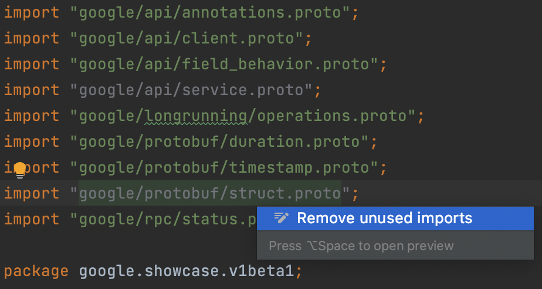
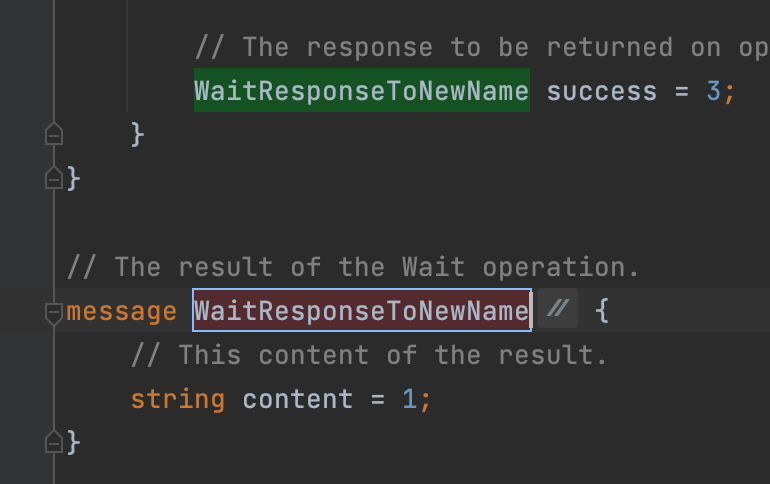
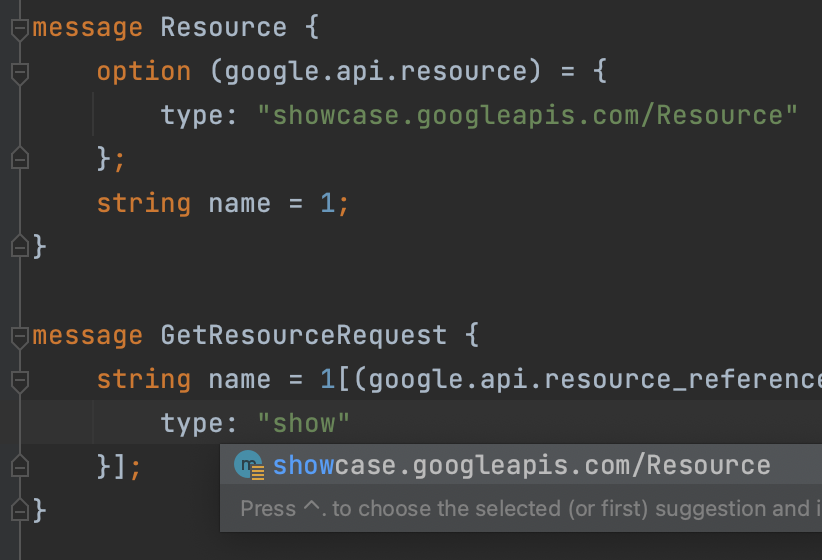
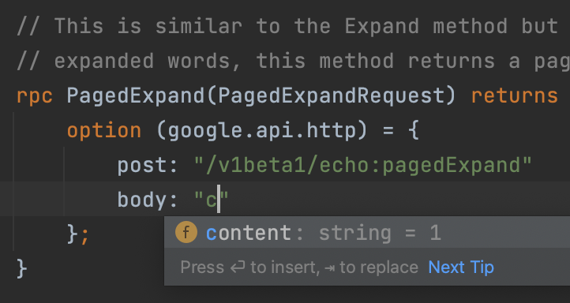

# IntelliJ Protobuf Language Plugin

## Reference

Inspired by [protobuf-jetbrains-plugin](https://github.com/ksprojects/protobuf-jetbrains-plugin)
and [intellij-protobuf-editor](https://github.com/jvolkman/intellij-protobuf-editor).

## Descriptor

<!-- Plugin description -->
IntelliJ-based IDEs Protobuf Language Plugin that provides Protobuf language support.

Analyzing features:

- [x] Syntax highlighting
- [x] Symbol and References
- [x] Import file from library and SDK
- [x] Navigation
- [x] Find Usage
- [x] Code folding
- [x] Semantic analysis
- [x] Struct Viewer

Editor features:

- [x] Auto Completion
- [x] Code format
- [x] Import optimizing
- [x] [AIP](https://google.aip.dev/) spec support

<!-- Plugin description end -->

Planned features:

- [ ] PSI stub
- [ ] Quick documentation
- [ ] Auto import
- [ ] Java/Kotlin code navigation
- [ ] [Sisyphus](https://github.com/ButterCam/sisyphus) framework integration

## Screenshots

### Features

1. Import optimizer
   
   
2. In-place rename
   
   
3. AIP-123 Resource Type
   

4. AIP-127 Http transcoding
   
   
More features wait for your discover...
