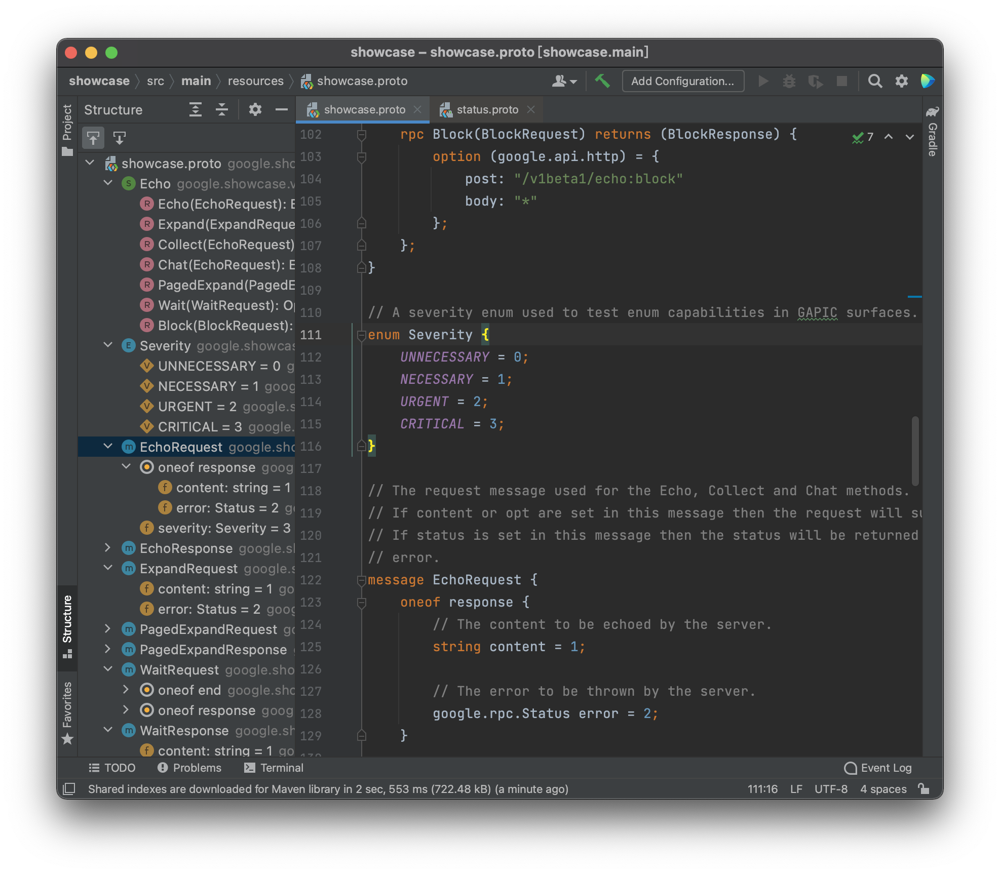
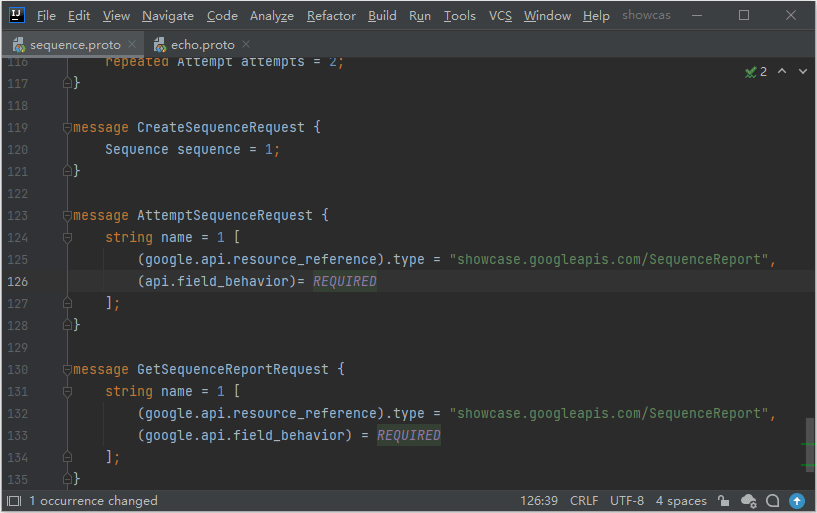
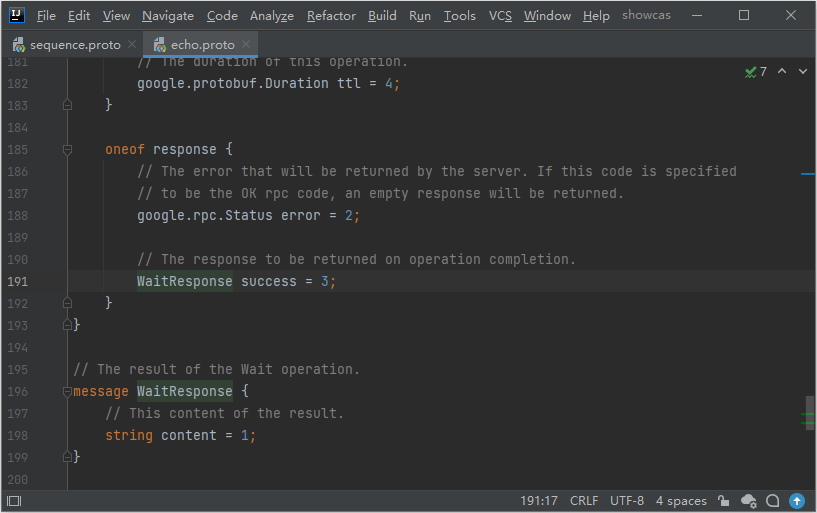
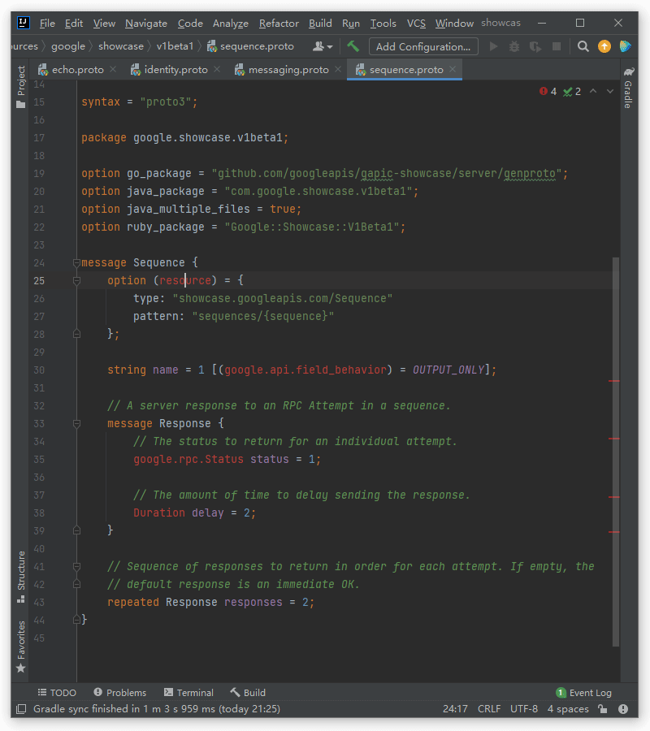
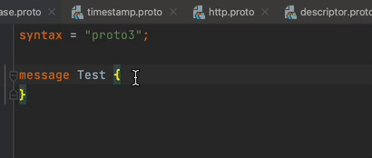
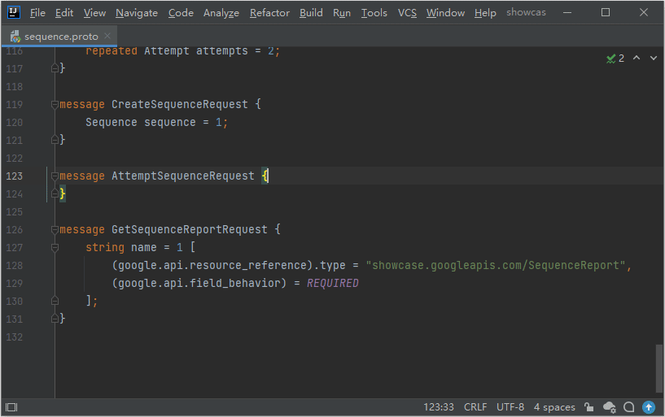

# IntelliJ Protobuf Language Plugin

## Reference

Inspired by [protobuf-jetbrains-plugin](https://github.com/ksprojects/protobuf-jetbrains-plugin)
and [intellij-protobuf-editor](https://github.com/jvolkman/intellij-protobuf-editor).

## Descriptor

<!-- Plugin description -->
IntelliJ-based IDEs Protobuf Language Plugin that provides Protobuf language support.

> ⚠️ Attention ⚠️  
> This plugin is not compatible with [Jetbrains Official Protobuf Plugin](https://plugins.jetbrains.com/plugin/14004-protocol-buffers) which is bundled in 2021.2 and later.  
> You should disable **Protocol Buffer** and **gRPC** to use this plugin.

Analyzing features:

✅ Syntax highlighting  
✅ Symbol and References  
✅ Import file from library and SDK  
✅ Navigation  
✅ Find Usage  
✅ Code folding  
✅ Semantic analysis  
✅ Struct Viewer  
✅ Quick documentation  
✅ PSI stub
✅ [Sisyphus](https://github.com/ButterCam/sisyphus) framework integration
⚠️ Java/Kotlin code navigation (Only for Sisyphus now)

Editor features:

✅ Auto Completion  
✅ Code format  
✅ Import optimizing  
✅ [AIP](https://google.aip.dev/) spec support  
✅ Auto import  
✅ Import quick fix

<!-- Plugin description end -->

## Screenshots

### Highlight Features

1. Import optimizer  
   

2. Reference  
   
   
3. In-place rename  
   

4. Auto completion  
   

5. Auto import  
   
   
6. AIP Spec
   
   
More features wait for your discovering...
