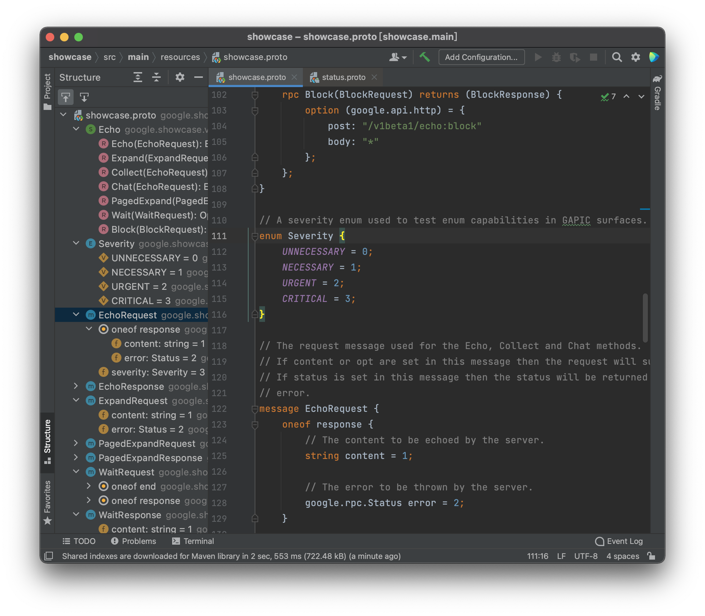
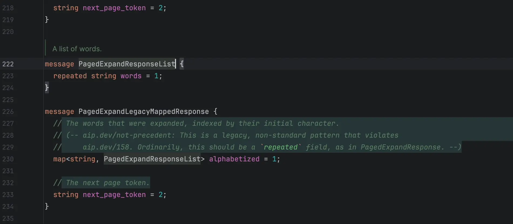
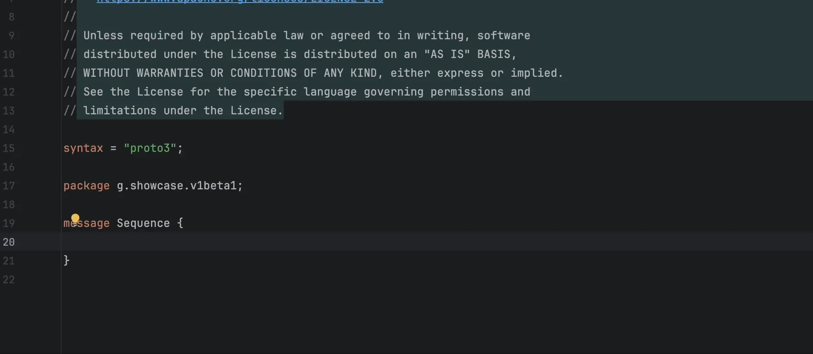
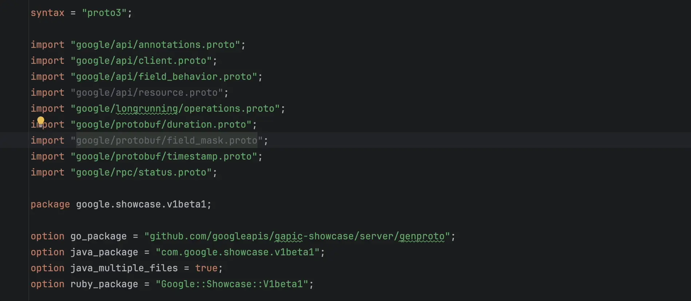
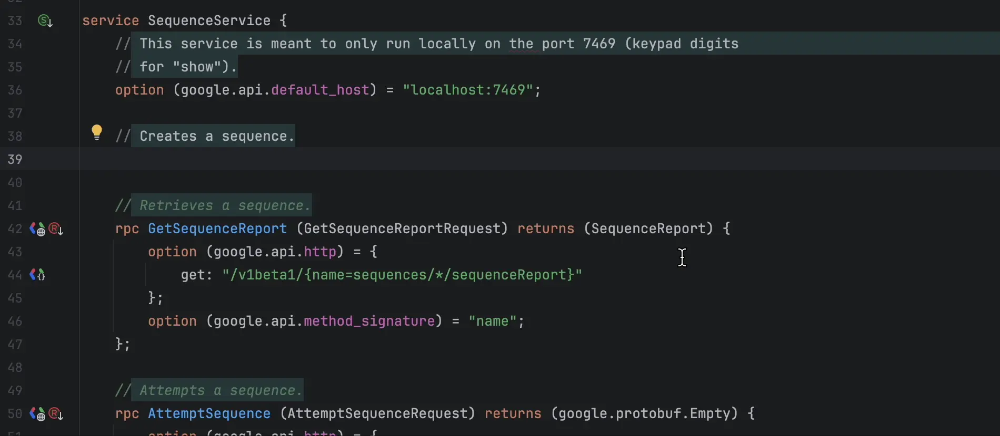

<div align="center">

#  IntelliJ Protobuf Language Plugin

**Full-featured Protocol Buffers support for JetBrains IDEs**

[](https://plugins.jetbrains.com/plugin/16422-protobuf)
[](https://plugins.jetbrains.com/plugin/16422-protobuf)
[](https://github.com/devkanro/intellij-protobuf-plugin/actions)

*Semantic analysis · Cross-file navigation · Multi-language integration · Protobuf Editions*

</div>

---

## ✨ What It Does

This plugin turns your JetBrains IDE into a protobuf-aware development environment — not just syntax highlighting, but deep understanding of your schema.

> [!WARNING]
> Not compatible with the bundled [JetBrains Protocol Buffer plugin](https://plugins.jetbrains.com/plugin/14004-protocol-buffers).
> Disable **Protocol Buffer** and **gRPC** before installing.

## 🚀 Quick Start

1. Open **Settings → Plugins → Marketplace**
2. Search for **"Protobuf"** by kanro
3. Install and restart

## 🔍 Feature Highlights

### Schema Intelligence

Understands your `.proto` files semantically — resolves types across files and imports, validates field numbers, checks naming conventions, and catches errors in real time.



### Cross-File Navigation

Go-to-definition, find usages, and rename refactoring that works across files, packages, and even library proto definitions.

<table>
<tr>
<td width="50%">

**Reference resolution**


</td>
<td width="50%">

**In-place rename**


</td>
</tr>
</table>

### Smart Editing

Auto-completion that understands context — types, field names, enum values, options. Auto-import and import optimization built in.

<table>
<tr>
<td width="50%">

**Auto import**


</td>
<td width="50%">

**Import optimizer**


</td>
</tr>
</table>

### Multi-Language Integration

| Module | Features |
|--------|----------|
| **Java / Kotlin** | Navigate between `.proto` and generated Java code |
| **Go** | Go code navigation, decompile from proto descriptors |
| **gRPC** | Send requests via [HTTP Client](https://plugins.jetbrains.com/plugin/13121-http-client), explore APIs via [Endpoints](https://plugins.jetbrains.com/plugin/16890-endpoints) |
| **AIP** | [Google API design](https://google.aip.dev/) spec validation and completion |
| **Sisyphus** | [Sisyphus](https://github.com/ButterCam/sisyphus) Kotlin framework integration |

### Modern Protobuf

- [Protobuf Editions](https://protobuf.dev/editions/overview/) (`edition = "2023"`) support
- [Text Format](https://protobuf.dev/reference/protobuf/textformat-spec/) (`.textproto`) with schema-based validation
- [Buf](https://buf.build/) support via [companion plugin](https://plugins.jetbrains.com/plugin/19147-buf-for-protocol-buffers)

### AIP Spec Support

Validates and auto-completes [Google API Improvement Proposals](https://google.aip.dev/) — resource definitions, HTTP rules, and naming conventions.



## 🤖 Copilot-Powered Development

This project uses AI-assisted development with a structured workflow:

```
brainstorm → implement → ship → reflect
```

Every non-trivial change goes through a **brainstorm** (design discussion with a state machine), followed by implementation, shipping with quality gates, and post-ship reflection. Learnings accumulate in a knowledge base that feeds back into future work.

See [`.github/copilot-instructions.md`](.github/copilot-instructions.md) for the workflow and [`.github/skills/`](.github/skills/) for the skill definitions.

## 📖 Documentation

| | |
|---|---|
| **[Overview](docs/overview.md)** | What the plugin does and why |
| **[Architecture](docs/architecture.md)** | How the pieces fit together |
| **[Getting Started](docs/getting-started.md)** | Build, run, and test |
| **[Contributing](docs/contributing.md)** | Code style and how to add features |
| **[Design Docs](docs/design/)** | Deep-dive into subsystem design decisions |
| **[Extension Points](docs/extension-points.md)** | API for extending the plugin |

## 🙏 Acknowledgments

Inspired by [protobuf-jetbrains-plugin](https://github.com/ksprojects/protobuf-jetbrains-plugin) and [intellij-protobuf-editor](https://github.com/jvolkman/intellij-protobuf-editor).